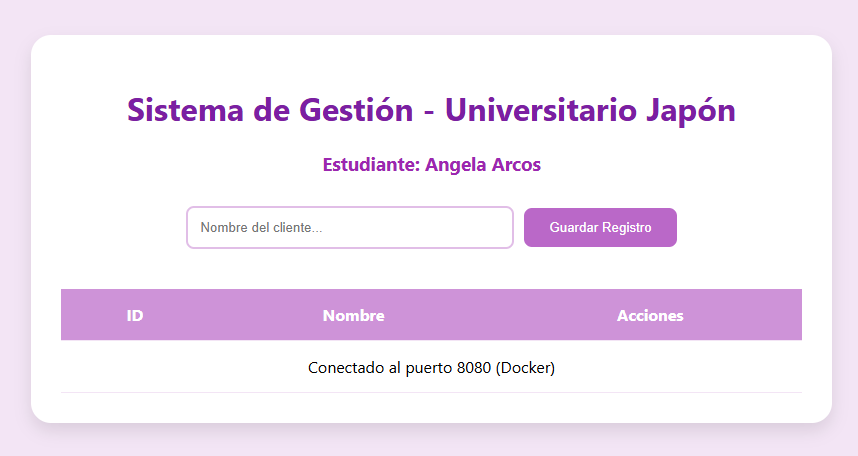
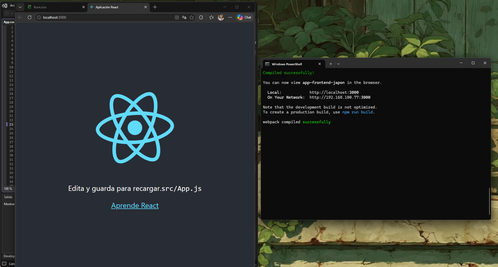

# Estudiante: Angela Arcos

# API Facturación (Microservicio de Clientes/Personas)

## Descripción
Este microservicio ha sido desarrollado para la asignatura de Aplicaciones Distribuidas. La API permite la gestión de registros de personas, facilitando operaciones CRUD a través de una arquitectura de microservicios. El servicio está construido con **.NET 8** y se despliega mediante **Docker** para asegurar la portabilidad del sistema.

## Modelo de Datos
La estructura de la entidad principal utilizada en este microservicio es la siguiente:

| Campo     | Tipo de Dato | Descripción                          |
|-----------|--------------|--------------------------------------|
| Id        | Integer      | Identificador único del registro     |
| Nombre    | String       | Nombre del cliente/persona           |
| Apellido  | String       | Apellido del cliente/persona         |
| Edad      | Integer      | Edad del usuario                     |
| Direccion | String       | Ubicación domiciliaria               |

## Endpoints
La API expone los siguientes puntos de acceso (Puerto 8080):

1. **GET `/api/persona`**: Retorna la lista completa de personas.
2. **GET `/api/persona/{id}`**: Busca una persona por su ID.
3. **POST `/api/persona`**: Crea un nuevo registro.
4. **DELETE `/api/persona/{id}`**: Elimina un registro existente.

## Conexión a Base de Datos
El microservicio interactúa con una base de datos **PostgreSQL** desplegada en Docker:
- **Contenedor**: `database-postgres`
- **Puerto Local**: `5434`
- **Estado**: Operacional y vinculado al microservicio.

## Evidencias
A continuación, se presentan las capturas que validan el proceso de desarrollo y despliegue:

### 1. Integración y Conexión
Prueba de que el Frontend reconoce el microservicio activo en Docker.

### 2. Implementación de Código y Docker
Muestra el código del controlador y el despliegue del contenedor mediante CLI.

### 3. Servidor Frontend
Evidencia del servidor de React en ejecución.

### 4. Instalación de Herramientas
Prueba de la configuración del entorno de desarrollo.

## Conclusión
Se logró integrar con éxito un frontend en React con un backend en .NET 8 utilizando contenedores Docker. A pesar de los retos en el mapeo de rutas, se comprendió la importancia de la configuración de CORS y la gestión de puertos en arquitecturas distribuidas.
